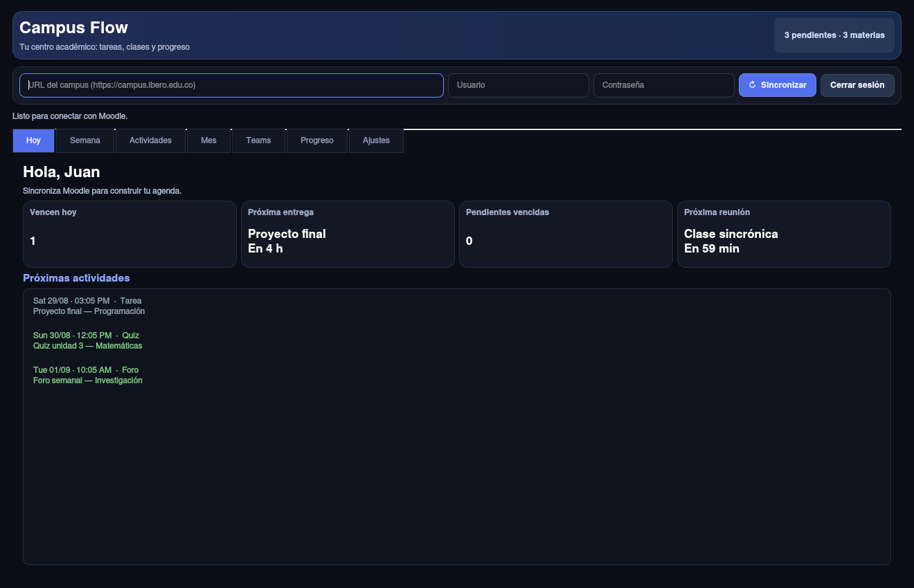

# Campus Flow 3.0

Campus Flow es un asistente académico de escritorio para estudiantes que usan
Moodle y Microsoft Teams. Reúne entregas, reuniones, progreso y calificaciones
en una interfaz privada que se ejecuta en el computador del usuario.



## Funciones

- Panel **Hoy** con próximas entregas, vencidas y siguiente reunión.
- Calendarios semanal y mensual.
- Búsqueda y filtros por materia, tipo y estado.
- Actividades completadas guardadas localmente.
- Reuniones de Teams agrupadas por materia, con copia y apertura del enlace.
- Calificaciones y progreso cuando Moodle habilita esas API.
- Recordatorios configurables de escritorio.
- Exportación iCalendar (`.ics`) e integración con Google Calendar y Outlook.
- Caché offline con fecha de última actualización.
- Diagnóstico de funciones que Moodle no expone.

## Seguridad y privacidad

- Las credenciales se envían por `POST` y únicamente a una URL HTTPS de Moodle.
- La contraseña nunca se guarda.
- El token se almacena en el llavero seguro del sistema mediante `keyring`.
- Si el sistema no ofrece un llavero, se usa un archivo privado con permisos
  `600` y la aplicación lo informa en **Ajustes**.
- Los datos académicos y preferencias permanecen en el equipo del usuario.
- **Cerrar sesión** elimina el token. **Olvidar cuenta** elimina además la caché.

## Instalación para desarrollar

Se necesita Python 3.11 o superior.

```bash
git clone https://github.com/gutierrezjuandavid094-netizen/Plataforma-ibero.git
cd Plataforma-ibero
python -m venv .venv
source .venv/bin/activate       # Windows: .venv\Scripts\activate
python -m pip install -r requirements.txt
python Main.py
```

También se puede instalar como paquete:

```bash
python -m pip install -e .
campus-flow
```

## Uso

1. Escribe la dirección raíz del Moodle de la universidad.
2. Ingresa el usuario y la contraseña del campus.
3. Presiona **Sincronizar**.
4. Revisa **Ajustes** si alguna función opcional no está habilitada por Moodle.

La aplicación puede leer la caché sin conexión. Para actualizar tareas,
calificaciones o reuniones sí necesita acceso al servidor Moodle.

## Pruebas

```bash
python -m pip install -e ".[test]"
QT_QPA_PLATFORM=offscreen python -m pytest
```

## Crear ejecutables

Linux:

```bash
./scripts/build_linux.sh
```

Windows (PowerShell):

```powershell
.\scripts\build_windows.ps1
```

Los resultados se guardan en `dist/`. Cada sistema debe compilar su propio
ejecutable; PyInstaller no realiza compilación cruzada.

## Estructura

```text
Main.py                         Lanzador
src/app.py                      Inicio de la aplicación
src/assets/                     Iconos de Linux y Windows
src/ui/main_window.py           Interfaz y vistas
src/services/moodle_client.py   API de Moodle
src/services/sync_service.py    Sincronización en segundo plano
src/services/storage.py         Sesión segura, caché y estado
src/services/calendar_export.py Exportación de calendarios
src/services/notifications.py   Recordatorios de escritorio
tests/                          Pruebas automáticas
legacy/                         Versión monolítica archivada
```

## Compatibilidad de Moodle

Las tareas y el calendario usan los servicios de la aplicación móvil oficial.
Calificaciones, progreso y algunos tipos de recursos dependen de lo que la
universidad haya habilitado. Un fallo opcional no interrumpe los demás datos y
queda explicado en **Ajustes → Diagnóstico**.

## Licencia

[MIT](LICENSE)
